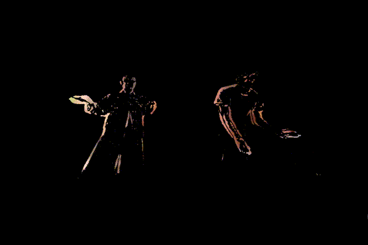
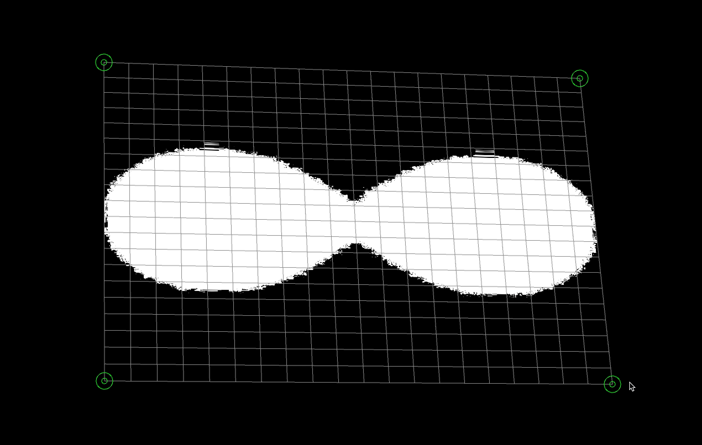
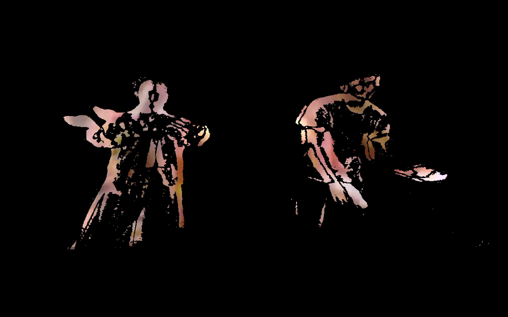
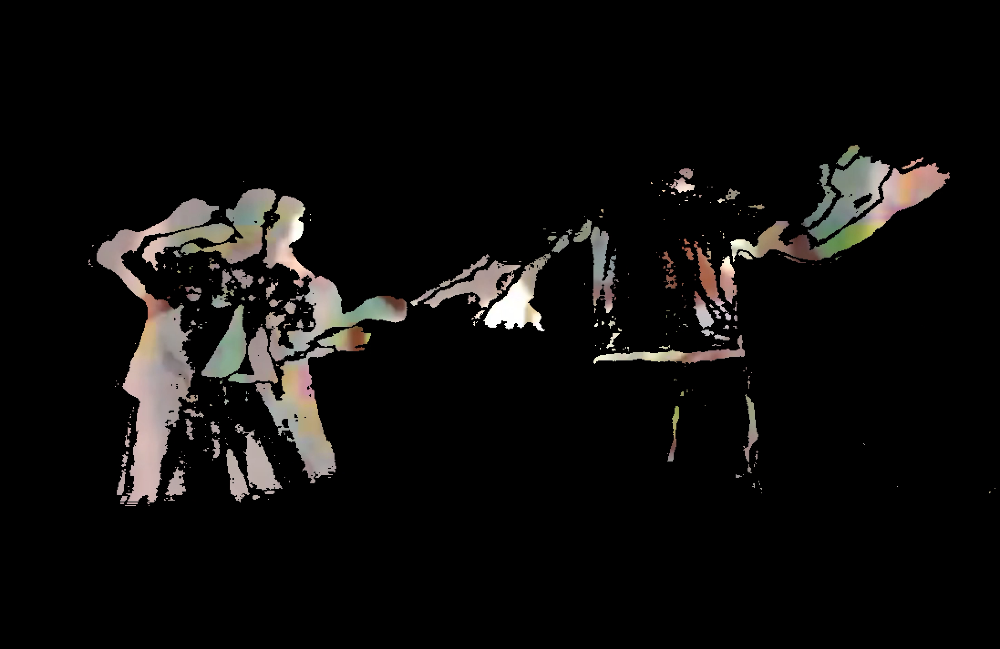

This is a project for the Processing IDE: https://processing.org

Connect your Kinect via USB, put the `infiniteKinection/` directory into your local `Processing/` projects directory, add your own `image.jpg` and `video.mov` files to the `data/` directory, and open it up in the Processing IDE to give it a whirl.

# Overview #

	- loads image, limiting the rendering area to white pixels only
	- enables calibration of rendering area for projection mapping on physical objects
	- tracks motion by putting Kinect infrared input through a simple frame differencing algorithm
	- replaces frame-differenced pixels with pixels from a looping movie file
 
# General Controls #

	NOTE: rendering is upside-down by default; using the 'l' key is your friend

	- Command + Shift + 'r' key: run in Presentation Mode
	- 'c' key: toggle Calibration Mode to finetune projection mapping / keystone on physical object
		- NOTE: this can be used to manually flip the rendering's vertical/horizontal orientation
	- 's' key: save the current Calibration to a file for future use
	- 'l' key: load the saved Calibration file

# Tuning Controls #

	NOTE: movementThreshold defaults to 20 when program starts

	- UP arrow key: increase current movementThreshold value by 2
	- DOWN arrow key: decrease current movementThreshold value by 2
	    - NOTE: movementThresholds less than 0 will result in only "movie" pixels displaying,
	        	(meaning that the Kinect feed will be completely overwritten / invisible)
	- LEFT arrow key: set movementThreshold to 10
	   	- NOTE: movementThresholds between 0 and ~20 may display outlines of stationary objects
	   			if they are close enough to the Kinect
	- RIGHT arrow key: set movementThreshold to 100
	   	- NOTE: higher movementThresholds greatly reduce the Kinect sensor's range
	   			(i.e. "distant" objects will disappear)

Calibration mode for projection mapping:

Stills:

